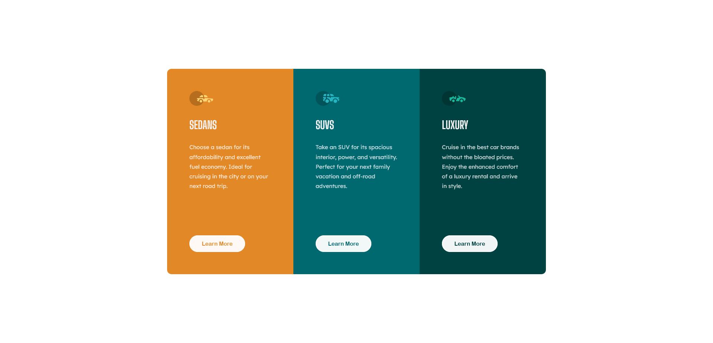
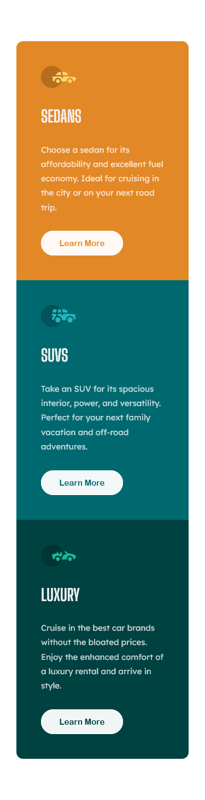

# Frontend Mentor - 3-column preview card component solution

This is a solution to the [3-column preview card component challenge on Frontend Mentor](https://www.frontendmentor.io/challenges/3column-preview-card-component-pH92eAR2-). Frontend Mentor challenges help you improve your coding skills by building realistic projects.

## Table of contents

-   [Overview](#overview)
    -   [The challenge](#the-challenge)
    -   [Screenshot](#screenshot)
    -   [Links](#links)
-   [My process](#my-process)
    -   [Built with](#built-with)
    -   [What I learned](#what-i-learned)
    -   [Continued development](#continued-development)
    -   [Useful resources](#useful-resources)
-   [Author](#author)
-   [Acknowledgments](#acknowledgments)

**Note: Delete this note and update the table of contents based on what sections you keep.**

## Overview

### The challenge

Users should be able to:

-   View the optimal layout depending on their device's screen size
-   See hover states for interactive elements

### Screenshot

**Desktop**



**Mobile**



### Links

-   Solution URL: [Github](https://github.com/gylim0604/FrontEnd-Mentor-3-column-preview-card-component)
-   Live Site URL: [Vercel](https://front-end-mentor-3-column-preview-card-component-three.vercel.app/)

## My process

### Built with

-   Semantic HTML5 markup
-   CSS Grid
-   Mobile-first workflow
-   SCSS

### What I learned

I learned how to achieve a better knockout text effect through the use of the [mix-blend-mode](https://developer.mozilla.org/en-US/docs/Web/CSS/mix-blend-mode) property.

```css
.a {
    // for knockout text effect, use mix-blend-mode
    background-color: $very-light-gray;
    color: black;
    mix-blend-mode: screen;
}
```

### Useful resources

-   [MDN docs](https://developer.mozilla.org/en-US/docs/Web/CSS/mix-blend-mode) - This got me to understand how mix-blend-mode works and which value would be the best for my case.

## Author

-   Frontend Mentor - [@gylim0604](https://www.frontendmentor.io/profile/gylim0604)
